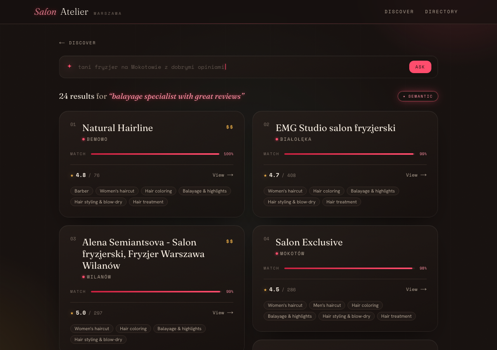
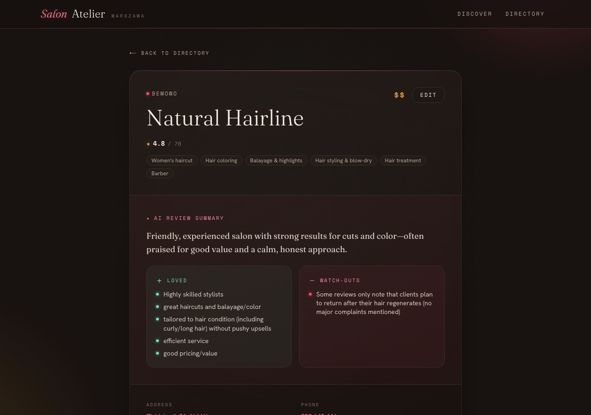

# Warsaw Beauty Salon Explorer

A full-stack application that collects hair & beauty salons across Warsaw,
serves them through a REST API, and presents them in a web UI where you can
**browse, filter, search in natural language, and edit** salon details.

Built for the **SumUp Warsaw Accelerator 2026** home task. AI is applied where
the task's hard problems actually live — **data quality** (LLM normalization +
embedding-based deduplication) and **discovery** (natural-language semantic
search + review summaries) — rather than bolted on.

| AI concierge (home) | Search results | Detail + AI summary |
| --- | --- | --- |
|  |  |  |

---

## Quick start

The repository ships with a committed dataset of **2,000+ real Warsaw salons** —
collected from Google Places, AI-enriched (normalized services, deduplicated,
review summaries), **with search embeddings included** — so the app runs
end-to-end with **no API keys**.

```bash
cp .env.example .env        # works out of the box — no keys required
docker compose up --build   # or: make up
```

| Service        | URL                            |
| -------------- | ------------------------------ |
| Frontend       | http://localhost:3000          |
| API (Swagger)  | http://localhost:8000/docs     |
| Health check   | http://localhost:8000/health   |

On first start the database is migrated and seeded automatically. Open
http://localhost:3000 — the home page is an **AI concierge**: describe what you
want in plain language and it takes you to ranked results.

> Browsing, filtering, salon details (with the AI review summaries), editing,
> and keyword search all work with **no keys**. Live **semantic** NL search
> needs an `OPENAI_API_KEY` — see [Data & keys](#data--keys).

## Screens

| Screen | Route | What you can see & do |
| --- | --- | --- |
| **Discover** (home) | `/` | A large natural-language search bar with rotating example prompts. Type a request in Polish or English (e.g. *"barber for a skin fade in Praga, open late"*) and submit to get ranked results. A small "trending" strip links into the directory. |
| **Search results** | `/search?q=…` | Ranked result tiles showing name, district, rating & review count, price, and services. A badge marks whether results came from AI **semantic** search or the **keyword** fallback; semantic results also show a relevance meter. Refine the query from the bar at the top. |
| **Directory** (browse) | `/browse` | The full catalogue of 2,000+ salons in a masonry grid, with **district** and **service** filters and pagination. Each card links to its detail page. |
| **Salon detail** | `/salons/[id]` | Full details — address (with a map link), phone, website, services, rating & review count — plus the **AI review summary** shown as a one-line vibe and colour-coded pros & cons. An **Edit** button opens an inline form to change any field; saves persist via the API. |

## The AI approach

AI is placed on the task's two hard problems:

1. **Data quality → an AI ingestion pipeline** (`backend/pipeline/`):
   - **Review-driven extraction**: Google gives salons only a coarse category and
     (almost always) no price, so a single LLM call reads each salon's **customer
     reviews** + categories and returns its actual **services** (mapped to a fixed
     taxonomy) plus a **price tier** inferred from review price language
     (*"przystępne ceny"* → `$`, *"zapłaciłam 400 zł"* → `$$$`). A deterministic
     primary-category floor guarantees the obvious core service is never missed.
   - **Embedding-based deduplication**: salons surfaced by overlapping searches
     are clustered by cosine similarity (guarded by name similarity) and merged.
   - **Review summarization**: reviews → a short vibe + pros/cons blurb.
2. **Discovery → hybrid semantic search** (`backend/app/services/search_service.py`):
   the LLM extracts structured filters; the query is embedded; a `pgvector`
   candidate pool is **re-ranked by a blended relevance score** — vector
   similarity + a review-count-weighted rating + soft filter matches. Filters
   *boost* rather than exclude (so a strict query never returns nothing); only an
   explicit district is hard. Falls back to trigram keyword search with no key.

This spans classical ML (embeddings, similarity, vector retrieval, ranking) +
applied LLM (review extraction, query understanding, summarization).

## How the data is built (methodology)

A four-stage pipeline (`backend/pipeline/`, run via `make pipeline`) turns raw
Google listings into the clean, enriched seed. Each stage is a separately-tested
module, and all AI access is injected so the whole flow runs offline with fakes
in tests.

### 1 · Collection — Google Places API (New)

`GooglePlacesCollector` ([`collectors/google_places.py`](backend/pipeline/collectors/google_places.py))
fans a **Text Search** across a grid of **18 district centroids × 6 query terms**
(`fryzjer`, `barber shop`, `salon kosmetyczny`, `paznokcie manicure`, …), pages
through the results, and de-duplicates by place id within the run. A narrow
**field mask** keeps each request in one billing tier while pulling everything
useful in a single call (no per-place Details round-trip):

- identity & contact — name, address, lat/lng, phone, website;
- signals — `rating`, `userRatingCount`, `types`, `primaryType` /
  `primaryTypeDisplayName`;
- **up to 5 full customer reviews** — the richest signal;
- `businessStatus` (permanently-closed places are dropped) and opening hours.

*Why Google Places?* Official, licensed, the widest field coverage, and a
reproducible query model. **What probing it taught us:** salons come with rich
reviews and categories, but `priceLevel`, `priceRange`, `editorialSummary` and
Google's own AI summaries are **almost always null** for salons — so a real
service list and a price band have to be *derived*. That is exactly what
enrichment does.

### 2 · Deduplication — embeddings

The same salon surfaces under several district/query searches. `Deduplicator`
([`enrichment/deduplicator.py`](backend/pipeline/enrichment/deduplicator.py))
embeds each salon's `name + address`, clusters entries whose cosine similarity
exceeds a threshold — guarded by a fuzzy **name** check so two different salons
at one address aren't merged — and collapses each cluster to a canonical record
that keeps the most-reviewed entry and remembers the merged source ids.

### 3 · Enrichment — services & price from reviews

`SalonNormalizer` ([`enrichment/normalizer.py`](backend/pipeline/enrichment/normalizer.py))
is the heart of the data-quality story:

- **District** is resolved deterministically from the address against the 18
  *dzielnice* — cheap and reliable, no LLM needed.
- **Services + price tier** come from **one structured LLM call** over the salon's
  `name + Google categories + customer reviews`. Reviews are what make this work:
  they name concrete services (*koloryzacja* → `hair-coloring`, *trwała* →
  `hair-styling`, *fade* → `mens-haircut`) that the coarse `types` never capture.
  The model maps onto the **fixed taxonomy** and is told to be evidence-based (no
  assuming a full menu from one mention).
- **Guardrails:** output is validated against known slugs; a deterministic
  **primary-type floor** unions in the obvious core service (a `barber_shop`
  always gets `barber`); `other` is dropped when any specific slug is present.
- **Price** is inferred from review language *only* — *"przystępne ceny"* → `$`,
  *"rozsądne"* → `$$`, *"drogo" / "zapłaciłam 400 zł"* → `$$$`, and **left blank
  when reviews say nothing about price** (honest over guessed). This fills the
  band Google never provides, so *cheap / mid-range / premium* become searchable.

### 4 · Summarization & search embedding

`ReviewSummarizer` ([`enrichment/summarizer.py`](backend/pipeline/enrichment/summarizer.py))
condenses up to 10 review snippets into a short **one-line vibe + Pros/Cons**
blurb — and returns nothing when a salon has no reviews, so the field is honestly
empty rather than invented. Finally each salon's `name + district + services +
summary` is embedded with `text-embedding-3-small` into `pgvector`, backing the
semantic search.

The per-salon LLM calls run **concurrently with retry/backoff**, so enriching
~2,000 salons takes minutes; the result is exported as the committed seed. On a
real run this produced an average of **~3.6 services per salon** with under **1%**
falling back to `other`.

## Tech stack

| Layer     | Choice                                                                 |
| --------- | ---------------------------------------------------------------------- |
| Backend   | Python · FastAPI · SQLAlchemy 2 · Alembic                              |
| Database  | PostgreSQL + `pgvector` (relational data + vector search in one)       |
| AI        | OpenAI — `text-embedding-3-small` (search/dedup) + GPT (extraction)    |
| Frontend  | Next.js 16 (App Router) · TypeScript · Tailwind CSS · SWR             |
| Data      | Google Places API (New)                                                |
| Tooling   | Docker Compose · uv · ruff · mypy · pytest · ESLint · Vitest · Playwright |

## Data & keys

The committed seed (`backend/data/seed/salons.json`) is **real data**: 2,000+
Warsaw salons collected from the Google Places API (New), run through the AI
enrichment pipeline, with a `text-embedding-3-small` vector stored alongside
each record. Because the embeddings ship in the seed, **no keys are needed to
run** — and there is no synthetic placeholder data.

| You want to… | Add to `.env` | Notes |
| --- | --- | --- |
| Browse / filter / view details / edit / keyword search | *(nothing)* | Works out of the box on the committed data. |
| Run **live semantic NL search** | `OPENAI_API_KEY` | Used only to embed the *query* at request time — salon embeddings are already committed, so no Google key or re-collection is needed. Without it, search falls back to keyword matching. |
| **Refresh or expand** the dataset | `OPENAI_API_KEY` + `GOOGLE_MAPS_API_KEY` | Re-collect from Google Places and re-enrich. |

```bash
make pipeline   # collect from Google Places + AI-enrich -> writes the seed
make seed       # load the seed into the database (idempotent upsert)
```

## API overview

Full interactive docs at `/docs`. Key endpoints:

| Method & path            | Description                                            |
| ------------------------ | ------------------------------------------------------ |
| `GET /salons`            | List (name, district, rating, price) + filters + pages |
| `GET /salons/{id}`       | Full salon details                                     |
| `PATCH /salons/{id}`     | Update a salon (validated, persisted)                  |
| `GET /salons/search?q=`  | Natural-language semantic search (keyword fallback)    |
| `GET /districts`         | Districts present in the data (for filters)            |
| `GET /services`          | Service taxonomy (for filters / editing)               |

## Development

```bash
make help          # list all tasks
make test          # backend (pytest) + frontend (vitest)
make lint          # ruff + mypy + eslint
make e2e           # Playwright end-to-end (needs the stack up)
make backend-dev   # uvicorn with autoreload
make frontend-dev  # next dev server
```

- **Backend tests** run against a dedicated `salon_test` database (created
  automatically) and never touch the app's data. OpenAI is faked in tests.
- **~88%** backend line coverage; CI gates at 80%.
- **Tests**: 60 backend (unit + integration on real Postgres/pgvector; plus 5
  live API smoke tests excluded by default), 12 frontend unit tests, and 3
  Playwright e2e specs.

## Project structure

```
backend/
  app/            FastAPI app — api/ services/ repositories/ models/ schemas/ ai/ core/
  pipeline/       ETL — collectors/ (Google Places) + enrichment/ (normalize, dedup, summarize, embed)
  alembic/        migrations          tests/  unit + integration
frontend/
  app/            App Router pages    components/  UI    lib/  typed API client
  __tests__/      component tests     e2e/  Playwright
docs/             architecture.md + milestones/ (M0–M8 build log) + screenshots/
```

## Technical solution & frameworks

- **Layered backend** (API → service → repository → ORM) with Pydantic DTOs
  distinct from SQLAlchemy models, and FastAPI dependency injection.
- **Strategy pattern** for data sources (`SalonCollector` → `GooglePlacesCollector`)
  and a provider abstraction for AI clients — both swappable, which is also how
  the project scales to new sources/regions.
- **Pipeline** as discrete, individually-tested stages (dedup → normalize →
  summarize → embed → load), with all AI access injected so it runs with
  in-memory fakes in tests.
- **Graceful degradation**: every AI feature has a non-AI fallback, so the app
  is fully functional with no API keys.
- One-command Docker run that migrates + seeds on startup; OpenAPI-typed API.

See [`docs/architecture.md`](docs/architecture.md) for diagrams, the data model,
and decision notes.

## Data quality & scaling to all of Poland

- **Messy / missing data** is handled by the enrichment pipeline: LLM
  normalization into a closed taxonomy (validated against known slugs),
  deterministic district/price resolution, embedding dedup with a name
  guardrail, nullable optional fields, and field back-filling when merging.
- **Scaling to Poland**: the collector Strategy pattern means new
  regions/sources are new collectors, not rewrites; ingestion is batched and
  the enriched output is cacheable; `pgvector` + pagination keep reads bounded;
  the same schema and API serve any city.

## What I'd improve with more time

- **More data sources (Booksy).** Reviews already drive service + price extraction; a **Booksy** collector (a new Strategy class) would add explicit service menus, prices and durations, and exercise real cross-source deduplication.
- **Expand the territory — starting with Kraków.** Lift the Warsaw-specific districts/grid into a per-city config and add a `city` dimension; the schema and API are already city-agnostic.
- **Learned ranking + an "open now" filter.** The hybrid relevance score uses fixed weights; click-through data could tune them. The pipeline now also captures opening hours, which an "open late / open now" filter could use.
